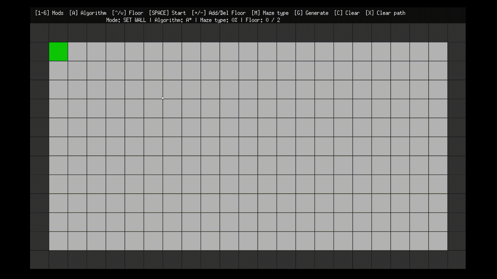

# Multi-Floor Maze Simulator (Go / Ebiten)

>An interactive, grid-based multi-floor maze simulator written in Go using the Ebiten game library.
The project combines procedural maze generation, manual map editing, and pathfinding visualization (A*, Dijkstra, BFS) across multiple floors connected by stairs. Traps affect movement cost, making weighted pathfinding meaningful.
---

## Preview




---

## Features

- Multi-floor maze (Z-levels) with stairs connecting floors
- Procedural generation using randomized DFS carving
- Optional extra connections to create less “perfect” mazes (loops)
- Trap placement tiles that increase movement cost
- Interactive editor (mouse) with editing modes:
  - Set Start / Finish
  - Toggle Walls
  - Place Stairs Up / Down
  - Place Traps
- Pathfinding visualization:
  - A* (Manhattan heuristic)
  - Dijkstra (weighted shortest path)
  - BFS (unweighted)
- Runtime floor management:
  - add/remove floors
  - switch active floor view
- On-screen stats: path cost, steps, visited, expanded

---

## Controls

### Keyboard

| Key | Function |
|--------|---------|
| 1 - 6 | Switch edit mode (Start / Finish / Wall / Stairs Up / Stairs Down / Trap) |
| A | Cycle algorithm: A* / Dijkstra / BFS |
| Arrow Up / Down  | Change viewed floor |
| G | Generate new maze (all floors) + stairs + traps |
| M | Change maze type (extra connections % loop density) |
| SPACE  | Run pathfinding from Start to Finish |
| X | Clear current path |
| C | Clear map to empty floor + borders (keeps Start/Finish) |
| + / - | Add / remove floors |

### Mouse

Left click on a cell to apply the current edit mode on the active floor.

---


### Maze Generation

The generator builds each floor by:
- Filling the grid with walls and adding border walls
- Carving corridors using DFS backtracking in steps of 2 cells
- Optionally adding extra connections (loops) with a probability
- Placing traps on random floor tiles
- Connecting floors with paired stairs

---

## Pathfinding & Costs

- Moving within the same floor costs 1
- Entering a trap tile costs 6
- Moving between floors via stairs costs 3

This makes Dijkstra/A* behave differently from BFS (which ignores weights).
---

## Project Structure
```
src/
├── main.go      # App entry point (loads assets, starts Ebiten)
├── maze.go      # Grid, cells, neighbors, movement costs
├── gen.go       # Procedural generation + traps + stairs
├── search.go    # A*, Dijkstra, BFS + statistics
├── ui.go        # Input handling, rendering, and on-screen UI
├── trap.png
├── stairsup.png
└── stairsdown.png
```
---

## Requirements

- Go (recommended 1.20+)
- Ebiten v2 (github.com/hajimehoshi/ebiten/v2

